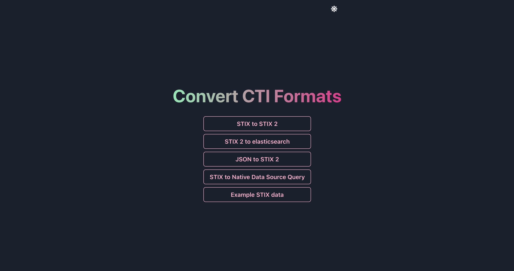

# Overview

An accessible POC website to convert threat intelligence formats. Note that this is not tested or robust or secure at the moment, it's just a proof of concept :wink:

# Instructions

Clone this repository and install docker. Then:
* `docker-compose build`
* `docker-compose up -d`
* `docker ps -a to get the id of the django container`
* `docker exec -it <container id goes here> /bin/bash`
* `python manage.py migrate`
* `python manage.py createsuperuser`
* `Go to localhost:8000/admin and add some data in`
* `Go to localhost:3000 to see the front end and you'll see the site!`

## Tech Stack

* Python
* Django
* React
* Chakra UI
* JavaScript
* Docker

## Backend Libraries

* [Stix 2 to elasticsearch](https://github.com/mitre/stix2patterns_translator)
* [JSON to STIX 2 and Stix to Native Data Source](https://github.com/opencybersecurityalliance/stix-shifter)
